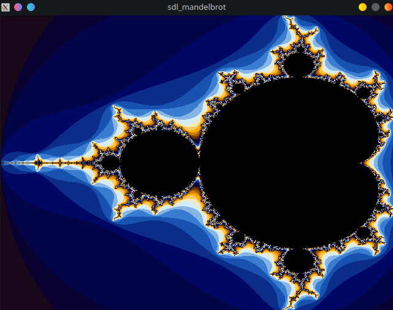

# sdl_mandelbrot
An implementation of the Mandelbrot set using C++ and SDL2.

## How to compile
You can compile through CMake:
```
mkdir build && cd build
cmake .. && make
./sdl_mandelbrot
```

## Screenshot
